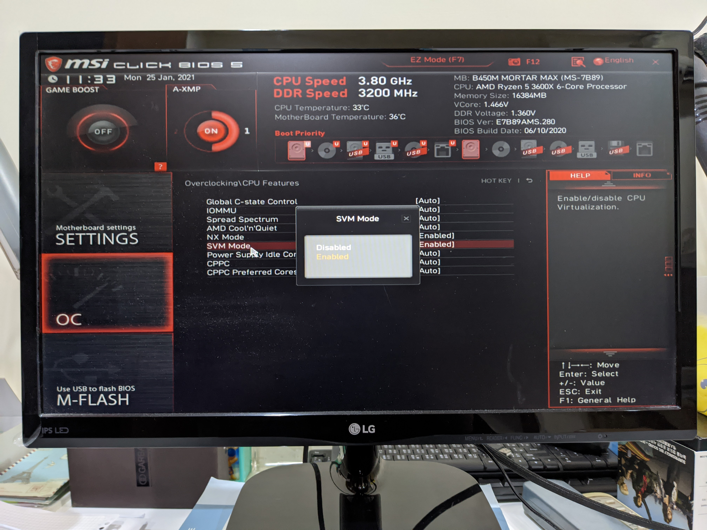

# Ubuntu on Ubuntu by libvirt
In this repo, I recorded (and later verified it by reproducing the steps) the steps involed when I created a Ubuntu 20.04 VM (Virtual Machine) with a shared folder with the host machine (in my case is Ubuntu 18.04).

Note: this tutorial can be executed fully through a remote machine with a VNC client (I used RealVNC on macOS) except the step when you need to enable the Virtualization depending on your CPU vendor (say Intel or AMD).

## Environment
* Host machine information:
    * `lsb_release -a`:
        ```
        No LSB modules are available.
        Distributor ID:	Ubuntu
        Description:	Ubuntu 18.04.5 LTS
        Release:	18.04
        Codename:	bionic
        ```
    * `uname -a`:
        ```
        Linux anji-MS-7B89 5.4.0-65-generic #73~18.04.1-Ubuntu SMP Tue Jan 19 09:02:24 UTC 2021 x86_64 x86_64 x86_64 GNU/Linux`
        ```

## Steps
* Enable your system VM acceleration technology. In my case, I enabled `SVM Mode`:

    

* Install required packages:

    ```
    $ sudo apt update
    $ sudo apt install qemu-kvm libvirt-daemon-system
    $ sudo apt install virt-manager
    ```

* Add your user to the `libvirt` group in order to manage it through the current user:
    ```
    $ sudo adduser $USER libvirt
    ```

* Download the Ubuntu 20.04 ISO image from <https://releases.ubuntu.com/20.04/>

* Install the guest machine by `virt-install` (You can tune the below options to meet your needs):

    ```
    $ vm_name="ubuntu-virtinstall"
    $ disk_path="/var/lib/libvirt/images/ubuntu-virtinstall.qcow2"
    $ img_path="your ubuntu 20.04 path"
    $ virt-install --virt-type kvm --name "$vm_name"  --ram 2048 --disk "$disk_path",format=qcow2,size=20 --network  network=default --graphics vnc,listen=127.0.0.1 --noautoconsole --os-type=linux --os-variant=ubuntu18.04 --cdrom="$img_path"
    ```

    * NOTE: the image at first should be owned by you. But because of `dynamic_ownership = 1`, you image will later be owned by `libvirt-qemu` and the group of `kvm`. Like this (after the ste:

        ```
        $ ls -al ubuntu-20.04.1-desktop-amd64.iso
        -rw-rw-r-- 1 libvirt-qemu kvm 2785017856  八   1  2020 ubuntu-20.04.1-desktop-amd64.iso
        ```

* Get your guest machine's VNC display port and use a VNC client (say RealVNC to connect it and finish the installation process):

    ```
    $ virsh vncdisplay ubuntu-virtinstall
    127.0.0.1:0
    ```

    * NOTE: You will need to turn the `Picture Quality` of the VNC client to `High`. Or it will keep showing failure...

* Wait for your guest machine to finish installation! And then `virsh start ubuntu-virtinstall`

* Let your virtual machine to have a fixed IP address by (See <https://libvirt.org/formatnetwork.html> for more information).
    ```
    $ virsh  dumpxml ubuntu-virtinstall | grep 'mac address'
          <mac address='52:54:00:b2:58:de'/>
    $ virsh net-edit default
    ...
    ...
    ...

    $ virsh net-destroy default
    $ virsh net-start default
    ```
    * My `default` network's xml looks like this:
        ```xml
        <network>
          <name>default</name>
          <uuid>53e1adb3-6d58-4be7-95a0-e489d89f1539</uuid>
          <forward mode='nat'>
            <nat>
              <port start='1024' end='65535'/>
            </nat>
          </forward>
          <bridge name='virbr0' stp='on' delay='0'/>
          <mac address='52:54:00:ab:ce:77'/>
          <ip address='192.168.122.1' netmask='255.255.255.0'>
            <dhcp>
              <range start='192.168.122.2' end='192.168.122.254'/>
              <host mac='52:54:00:b2:58:de' name='ubuntu-virtinstall' ip='192.168.122.3'/>
            </dhcp>
          </ip>
        </network>
        ```

* Remember to run `sudo apt install -y openssh-server` in the guest machine. So that you can use `ssh` to connect into it!

* TODO


## FAQ

## References
* [https://forums.tomshardware.com/threads/what-is-svm-mode-in-bios.3415554/](https://forums.tomshardware.com/threads/what-is-svm-mode-in-bios.3415554/)
* <https://ubuntu.com/server/docs/virtualization-libvirt>
* [https://gowa.club/Linux-Unix/RealVNC的VNC-Viewer连接到VM虚拟机出错的问题.html](https://gowa.club/Linux-Unix/RealVNC%E7%9A%84VNC-Viewer%E8%BF%9E%E6%8E%A5%E5%88%B0VM%E8%99%9A%E6%8B%9F%E6%9C%BA%E5%87%BA%E9%94%99%E7%9A%84%E9%97%AE%E9%A2%98.html)
* <https://libvirt.org/formatnetwork.html>
* <https://superuser.com/questions/341594/qemu-vnc-how-to-use-absolute-pointing-device>
* <https://serverfault.com/questions/627238/kvm-libvirt-how-to-configure-static-guest-ip-addresses-on-the-virtualisation-ho>
* <https://bugs.launchpad.net/ubuntu/+source/libvirt/+bug/1784001>: Libvirt `dynamic_ownership`'s behavior
